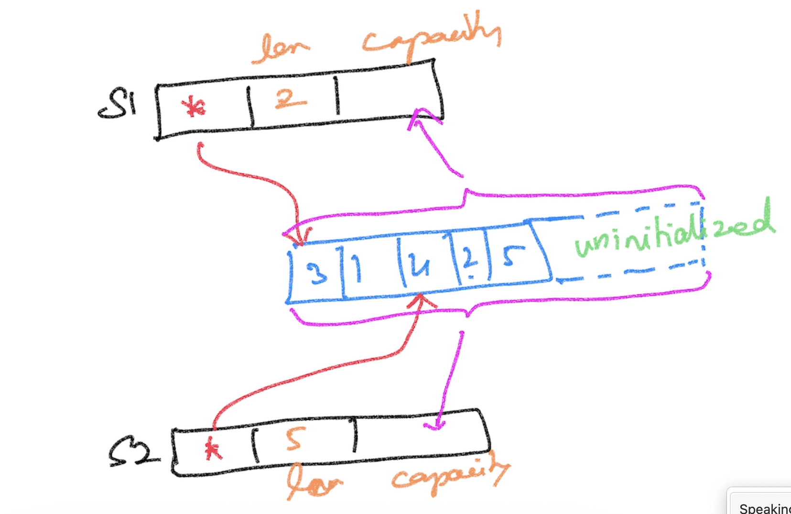
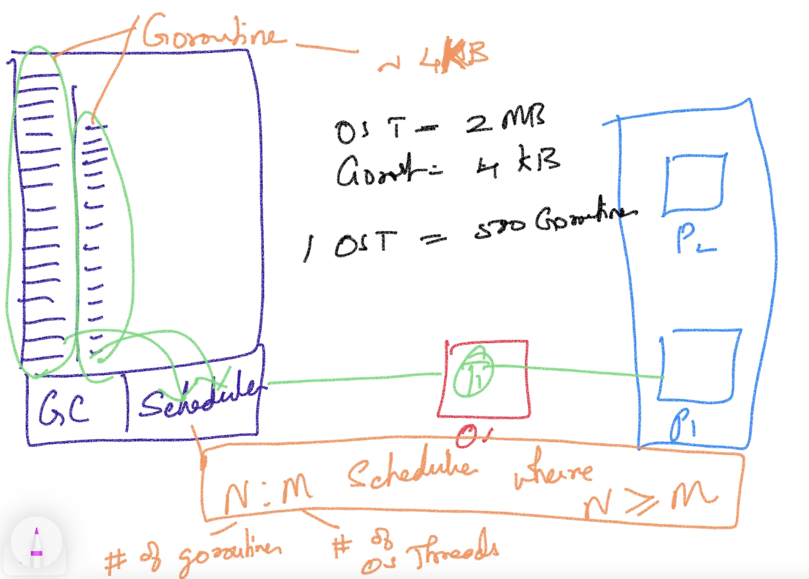
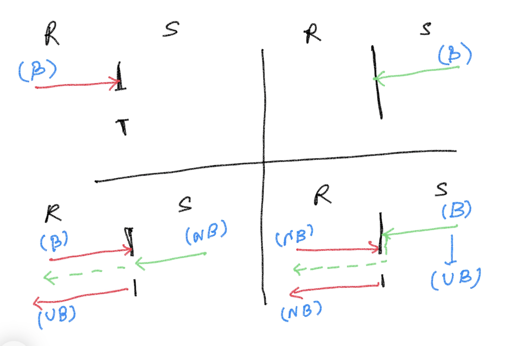

# Go Foundation

## Magesh Kuppan

## Schedule
- Commence      : 9:00 AM
- Tea Break     : 10:30 AM (20 mins)
- Lunch Break   : 12:30 PM (1 hr)
- Tea Break     : 3:00 PM (20 mins)
- Wind up       : 5:00 PM

## Methodology
- No powerpoint
- 100% code driven class

## Repo
- https://github.com/tkmagesh/cisco-go-nov-2023

## Software Requirements
- Go Tools (https://go.dev/dl)
- Visual Studio Code (https://code.visualstudio.com)
- Go Extension for VSCode (https://marketplace.visualstudio.com/items?itemName=golang.Go)

## Why Go?
- Simple Language
    - ONLY 25 keywords
    - No access modifiers (private/public/protected etc)
    - No classes (ONLY structs)
    - No inheritence (ONLY composition)
    - No reference types (Everything is a value)
    - No pointer arithmatic
    - No exceptions (ONLY errors)
    - No try..catch..finally construct
    - No implicit type conversion
- Close to hardware
    - Compiled to machine code
    - Extremely fast startup
    - Very lightweight (no need for VM, App Servers etc)
    - Tools for cross-compilation
- Concurrency
    - Builtin scheduler
    - Lightweight concurrency model (goroutine)
    - 1 goroutine = ~4KB (whereas 1 OS Thread = ~2MB)
    - Concurrency features are built in the language
        - go keyword, chan datatype, channel operator (<-), range, select-case
    - SDK support
        - sync package
        - sync/atomic packages

## Run a go file
- go run <filename.go>

## Create a build
- go build <filename.go>
- go build -o <bindary_name> <filename.go>

## Cross Compilation
- To get the list of platforms supports
    >go tool dist list
- To get the list of environment variables
    >go env
- To get the value of given environment variables
    - >go env <var_name_1> <var_name_2> ....
    - >ex: go env GOOS GOARCH
- To set the environment variables
    >go env -w <var_name_1>=<value_1> <var_name_2>=<value_2> ...
- To cross compile
    - Set the appropriate values for the GOOS & GOARCH env variables and create a build
        - >go env -w GOOS=windows GOARCH=amd64
        - >go build <file_name.go>
    - One can also combine the above steps
        - >GOOS=windows GOARCH=amd64 go build <file_name.go>

## Data Types
- string
- bool
- integer types
    - int8
    - int16
    - int32
    - int64
    - int
- unsigned integer types
    - uint8
    - uint16
    - uint32
    - uint64
    - uint
- floating point types
    - float32
    - float64
- complex number types
    - complex64 (real [float32] + imaginary [float32])
    - complex128 (real [float64] + imaginary [float64])
- type aliases
    - byte (alias for uint8)
    - rune (alias for int32)(unicode code point)

## Variable Declarations
- using "var" keyword
- using ":=" 

## Variable Scope
- package scope
    - Cannot use ":="
    - Can have unused variables
- function scope
    - Can use both ":=" & "var"
    - Cannot have unused variables 

## Constants
- can have unused constants at both package & function scope

## Constructs
1. if else
2. for
3. switch case

## Functions
- Can have more than one return results (named result)
- Variadic function
- Anonymous function
- Higher Order functions
    - Assign functions as values to variables
    - Pass functions as arguments
    - Return functions as return values

## Errors
- Errors are just values
- Errors are not "thrown" but returned from functions
- Errors implement the "error" interface (prescribed)
- Errors can be created using the following:
    - errors.New()
    - fmt.Errorf()

## Panic & Recovery
**Panic** - the state of the application where the application execution cannot proceed further

## Collections
- Only 3 types (Array, Slice & Map)

### Array
- Fixed sized collection of data of the same type
- Memory allocation and initialization happens at the declaration itself

### Slice
- Varying sized collection of data of the same type
- We do not mention the size of the list in declaration
- Use **make** function to customize the memory allocation 
- len -> allowed # of values that can be accessed from the underlying array
- capacity -> overall memory allocated to the underlying array (initialized + uninitialized)

### Map
- collection of key/value pairs

## Modularity
Application is organized interms of "modules" & "packages"

### Module
- Any code that need to be versioned and deployed together (application)
- Typically it is a folder with the **go.mod** file
- go.mod
    - name of the module (preferrably the repo path)
    - the targetted go runtime version
    - dependencies
- To create a module
    > go mod init <module_name>
- To execute a module
    > go run .
- To create a build
    - >go build .
    - >go build -o <binary_name> .
- To get the 3rd party modules (downloaded by default in **GOPATH/pkg** folder)
    > go get <module_name>
- To download the dependencies referenced in the go.mod file
    > go mod download
- To install command line tools built in go (downloaded by default in **GOPATH/bin** folder)
    > go install <module_name>
- To localize the dependencies
    > go mod vendor
- To list the dependency modules
    > go list -m all
- Other useful commands
    - > go mod graph
    - > go mod why <module_name>
- Reference: https://go.dev/ref/mod
### Package
- Internal organization of code in a module
- Typically a folder
- All the code across the files in a folder are considered to be ONE entity

## Structs
- How we create "class" in go

## Method
- A function with a receiver
- Use a pointer as a receiver if the method changes the state of the object
- The Type for which the method is created and the method definition must be in the same package. In other words, both the type definition and the method definition must be in the same package.

## Interfaces
- Interfaces are "implicitly" implemented in go
- Interfaces can be composed to create higher level of abstractions

## Concurrency
- Builtin Scheduler (as a part of the application binary)
- A concurrent operation (function) is represented as a "goroutine"
- A goroutine is a lightweight thread (~4KB whereas a OS thread is ~2MB)

### sync.WaitGroup
- Semaphore based counter
- Ability to block the execution of the current function until counter becomes 0
### Data Race
- To detect data race
    - >go run **-race** filename.go
    - >go build **-race** filename.go
    - Note : DO NOT create a production build with race detector

### Channels
- Enable us to share memory by communicating
- Declaration
    - > var ch chan int
- Initilization
    - > ch = make(chan int)
- Operations
    - using the channel operator ( <- )
    - Send Operation
        - > ch <- 100
    - Receive Operation
        - > data := <- ch
- Channel Behaviors
    - Receive Operation
        - always a blocking operation
        - blocked until the data becomes available in the channel
    - Send Operation
        - blocked until a receive operation is initiated (conditional)
        - In the case of a buffered channel, a send operation can succeed even when a receive operation is not initiated (unless the buffer is full)
    
    - A receive operation on a "closed" channel will return default value of the channel data type